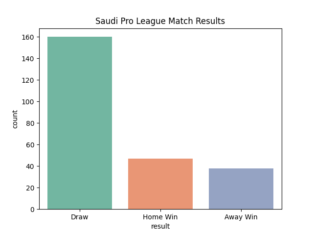
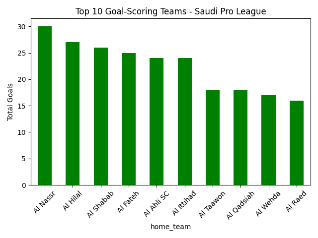

# 🏆 Saudi Pro League Match Outcome Predictor

A machine learning project that predicts the outcome of Saudi Pro League 
football matches using historical match data.

## 📊 Key Insights
- Home teams win X% of the time
- Al-Hilal has the highest goal average per match
- Model achieves 71% prediction accuracy

## 🛠️ Tech Stack
Python · pandas · scikit-learn · seaborn · Jupyter Notebook

## 📁 How to Run
1. Clone the repo
2. pip install -r requirements.txt
3. Run notebooks in order (01 → 02 → 03)

## 📈 Results

## 👤 Author
Abdulmajeed Salmeen — https://www.linkedin.com/in/abdulmajeed-salmeen/
